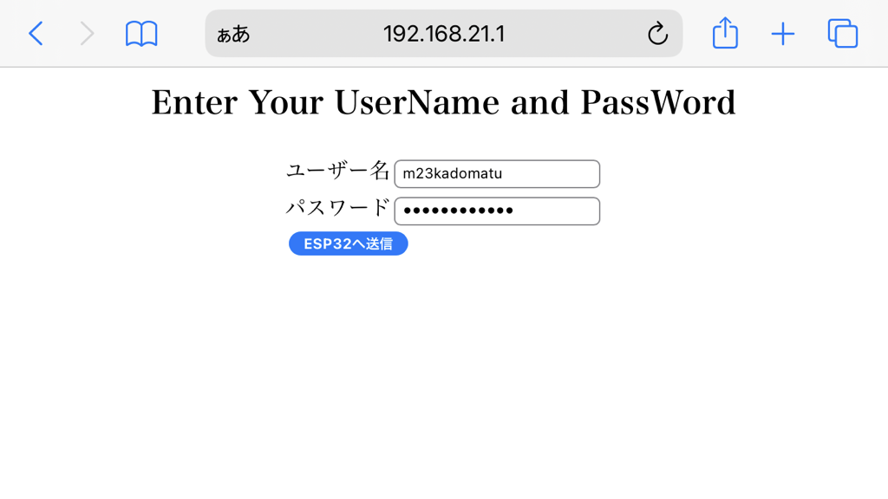

# esp32_TCT_WiFi
某高専内でESP32からインターネットに出るための処理をまとめたライブラリです.

早い話がesp32の [WiFiライブラリ](https://github.com/espressif/arduino-esp32/tree/master/libraries/WiFi) のラッパーライブラリです.

コンセプトは「できるだけ分かりやすく・使いやすく」です.

<br>

創造演習やら卒研やら単に構内でESP32で遊ぶやら, 自由に使ってください.


<br>

## Requirement
- [PlatformIO](https://docs.platformio.org/en/stable/integration/ide/vscode.html)  を使っている場合は特に何もなし

<br>

- ArduinoIDE を使っている場合は[ボードマネージャURL](https://arduinobook.stradty.com/accounts/Appendix3-1/#arduino%E7%92%B0%E5%A2%83%E3%81%A7%E9%96%8B%E7%99%BA%E3%81%A7%E3%81%8D%E3%82%8B%E3%82%88%E3%81%86%E3%81%AB%E3%81%97%E3%81%A6%E3%81%BF%E3%82%88%E3%81%86)を設定すること<br>
ちなみに ↑ のページのIDとパスワードが分からない場合は,[ここにアクセスする](https://kosenjp.sharepoint.com/sites/tokuyama_math/Shared%20Documents/Forms/AllItems.aspx?csf=1&=&e=KqWJAU&cid=c6b07108%2D9ebd%2D4086%2D9b64%2Db93a75877c42&FolderCTID=0x012000BB4AF7FACC37C8499A7FDC4EDFA32C79&id=%2Fsites%2Ftokuyama%5Fmath%2FShared%20Documents%2F%E3%82%B3%E3%83%B3%E3%83%94%E3%83%A5%E3%83%BC%E3%82%BF%E9%96%A2%E9%80%A3%2F4%5FC%E3%81%A8Arduino&viewid=2457f412%2D06ce%2D47d6%2Da1a7%2D51703d5e915a).

<br>

## Install
```bash
# くろーん
> git clone git@github.com:physics11688/esp32_TCT_WiFi.git

# ↑ が出来ない人は ssh を調べるとして, とりあえず ↓ で出来る
> git clone https://github.com/physics11688/esp32_TCT_WiFi.git

# 移動
> cd esp32_TCT_WiFi.git

> ls
合計 236
drwxrwxrwx 1 -----   4096 12月  9 15:23 ./
drwxrwxrwx 1 -----   4096 12月  9 15:17 ../
drwxrwxrwx 1 -----   4096 12月  9 13:40 .git/
-rwxrwxrwx 1 -----   3302 12月  9 15:56 README.md*
drwxrwxrwx 1 -----   4096 12月  9 14:34 TCT_WiFi/     # こいつをまるごとコピーして使う
drwxrwxrwx 1 -----   4096 12月  9 15:23 examples/
-rwxrwxrwx 1 ----- 233650 12月  9 15:17 pic.svg*

# ArduinoIDEの場合
## Windows
> Copy-Item .\TCT_WiFi\ "${HOME}\Documents\Arduino\libraries\" -Force -Recurse

## Linux or Mac
> cp -r ./TCT_WiFi/ "${HOME}\Documents\Arduino\libraries\"

```
<br>

#### TCT_WiFi/の設置場所
クローンして出来た `TCT_WiFi/` を ↓ のように設置すればいい.

<br>


<br>


<br>

## Usage

メインファイルで ↓ のように使ってください.

1. WiFiに接続して

2. ブラウザを使わずに認証

します.

<br>

### 通常版

<br>

> **Warning**
> - コード内にアカウントとパスワードを書く必要があるので, <br>
> ESP32を放置する場合はバイナリを吸い出されないように
> <br>
> 
> - ↑と同じでコードの共有(githubとか)するときは気をつけるできればスクリプトを書いて<br>
> pushの前に個人情報を隠す処理をした方がいい
>
> <br>
> 

<br>


```cpp
#include <Arduino.h>   // platformio 用
#include "TCT_WiFi.h"  // インクルードします
const char* SSID      = "TCT802.1X";       // アクセスポイントの SSID
const IPAddress ip(192, 168, 43, 50);      // TCT内で使用したいIPアドレス. 重複していないもの使う.
// 利用可能IPアドレス: 192.168.40.2 ~ 192.168.47.254

const char* USER_NAME = "m99kadomatu";     // アカウント名: m99kadomatu とか
const char* PASSWORD  = "trumpet23234";   // パスワード: trumpet23234 とか

void setup() {
    Serial.begin(115200);
    delay(10);

    // 1/2. wifi接続. この時点ではLANには参加してるけど外には出れない
    // connect_TCTwifi() は 30秒待ってもLANに参加できないときは再起動するようにしてある
    IPAddress localIP = connect_TCTwifi(SSID, ip, USER_NAME, PASSWORD);
    Serial.print("local IP: ");
    Serial.println(localIP);

    // 2/2. 認証チェック
    int counter = 0;                     // カウンタ
    while (check_auth() != IN_ENABLE) {  // 認証されていなければループ
        authenticate();                  // 認証開始
        delay(500);
        Serial.print("-|");
        counter++;
        if (counter >= 20) {  // 10秒経過したら
            ESP.restart();    // ESP32ボードをリセット
        }
    }
    Serial.println("");


    /********** ここから自分のやりたい処理を書く **************/
    // TCP/IP通信でも, http通信でもなんでもいい
}

void loop() { 
    delay(1000);
}

```

<br>

### セキュア版

- ESP32でアクセスポイントを立てます<br>

- スマホやPCで ESP32_TestAP って名前のアクセスポイントに接続します<br>

- ↑ の端末のWebブラウザで [192.168.21.1](http://192.168.21.1) へアクセスしてください<br>

- 認証用のユーザー名とパスワードを入力します<br>

- アクセスポイントの機能を終了し, 認証プロセスへ移行します

<br>




```cpp
#include <Arduino.h>
#include "TCT_WiFi.h"


const char* ESP32_ssid  = "ESP32_TestAP";  // ESP32のアクセスポイント名
const char* AP_password = "test12345";     // ↑ のパスワード
const char* SSID        = "TCT802.1X";     // 接続したいアクセスポイントの SSID
const IPAddress ip(192, 168, 43, 50);      // TCT内で使用したいIPアドレス. 重複していないもの使う.
// 利用可能IPアドレス: 192.168.40.2 ~ 192.168.47.254

void setup() {
    Serial.begin(115200);
    delay(10);

    get_param(ESP32_ssid, AP_password);  // アクセスポイント＋WebForm
    IPAddress localIP = connect_TCTwifi_Secure(SSID, ip);  // セキュア版
    Serial.print("local IP: ");  // 以降は通常版と同じ
    Serial.println(localIP);

    // 認証チェック
    int counter = 0;                     // カウンタ
    while (check_auth() != IN_ENABLE) {  // 認証されていなければループ
        authenticate();                  // 認証開始
        delay(500);
        Serial.print(".");
        counter++;
        if (counter >= 20) {  // 10秒経過したら
            ESP.restart();    // ESP32ボードをリセット
        }
    }
    Serial.println("");


    /********** ここから自分のやりたい処理を書く **************/
}

void loop() { delay(1000); }
```